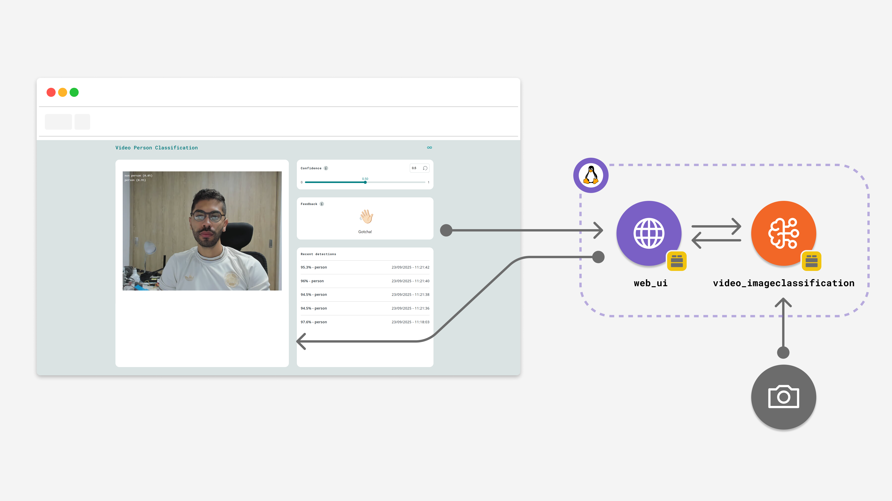

# Clasificador de hojas de plantas
The **Person Classifier** example lets you detect people on a live feed from a camera and visualize the model inference result on a user-friendly web interface.

**Note:** This example requires to be run using **Network Mode** in the Arduino App Lab or in **Single-Board Computer (SBC)** mode. Because you will need a USB-C hub and a USB camera.

This example uses a pre-trained model to detect people on a live video feed from a camera. The workflow involves continuously getting the frames from a USB camera, processing it through an AI model using the `video_imageclassification` Brick, and displaying the classification along with their corresponding probabilities. The code is structured to be easily adaptable to different models.
  

## Requisitos de Hardware

•	Arduino UNO Q
•	See3CAM
•	Arduino MODULINO DISTANCE (vl53l4cd)
•	Arduino MODULINO THERMO 
•	Chasis carrito aluminio
•	4 llantas omnidireccionales
•	Power bank
•	4 motor DC
•	2 modulo puente H L298
•	Porta pilas 
•	2 baterías Litio recargables
•	Cables dupont jumpers
•	Trípode 
•	Cables de datos usb

### Software

- Arduino App Lab

   
## How it Works

This example hosts a Web UI where we can see the video input from the camera connected via USB. The video stream is then processed using the `video_imageclassification` Brick. When a person is detected, it is logged along with the confidence score (e.g. 95% person).

